# OpenClaw × WorkAdventure Integration Plan

> **TL;DR:** An OpenClaw skill that drops AI agents into self-hosted WorkAdventure as real avatars. Playwright automates a headless browser per agent — logging in, moving, and injecting WA Scripting API hooks for proximity chat (text + voice via STT/TTS). Matrix provides fallback messaging. No WA backend mods required; everything runs as a single skill folder deployable via `clawdhub install agentadventure` or manual placement in `~/.openclaw/skills/`.

## Table of Contents

- [Architecture](#architecture)
- [Key Files & Snippets](#key-files--snippets)
- [Risks, Mitigations & Verification](#risks-mitigations--verification)
- [Phased TODO List](#phased-todo-list)
- [Security Audit Checklist](#security-audit-checklist)
- [Deployment Guide](#deployment-guide)

-----

## Architecture

### Specs & Assumptions

**OpenClaw (latest)**
Self-hosted AI agents with skills as SKILL.md-frontmatter bundles, browser tool via Playwright, channels (e.g., Matrix), and a gateway for sessions/tools.

**WorkAdventure v1.28.9** (latest as of Feb 23, 2026)
Self-hosted virtual office with Scripting API (`WA` object) for client-side JS/TS. Bots via OpenAI/Custom LLM/Tock/Scripting (not native in self-hosted). Includes Matrix chat integration, proximity chat via zones, and avatars movable via API.

Scripting API supports:

- **Proximity:** `WA.player.proximityMeeting.onJoin()` (Observable); `WA.players.onPlayerEnters` / `onPlayerLeaves` (requires `configureTracking()`); `startAudioStream`, `listenToAudioStream`
- **Chat:** `sendChatMessage`, `onChatMessage`, `startTyping`, `stopTyping` (with `'bubble'` scope)
- **Voice:** Experimental `startAudioStream`/`listenToAudioStream` (Float32Array buffers; sample rate TBD — WA blog shows 24kHz PCM16→Float32 conversion) + OpenClaw voice for STT/TTS piping

No breaking changes since v1.28. VP9 codec is default but irrelevant for text/voice piping.

**Goal:** Agents as “real” WA users — visible avatars, movement, proximity chat/interactions with humans and other agents.

**Key Assumptions:**

- Self-hosted WA uses Docker; agents control WA via browser automation (Playwright)
- No direct WA backend mods — minimal footprint, reuse OpenClaw patterns
- WA self-hosted supports Scripting API in automated browsers
- Playwright can inject/bridge events via `page.exposeFunction` or websockets
- OpenClaw gateway handles callbacks (via Matrix or custom channel)
- WA v1.28+ supports WebRTC/LiveKit for proximity audio
- OpenClaw 2026 has voice-call bundled skill and community voice skills (ElevenLabs, Deepgram for STT/TTS)
- Playwright v1.42+ supports timeouts/retries natively
- Errors are non-fatal and recoverable
- Good intent (adult users); good perf (events/streams not high-volume)

**Constraints:** No code implementation — reuse OpenClaw skills pattern; concrete snippets only.

### High-Level Architecture

**Core:** Extension as OpenClaw skill `"AgentAdventure"` — spawns a Playwright browser session in WA, injects scripts for avatar control, and bridges agent logic to WA actions (move, chat, interact).

**Reuse:** Playwright for browser, Matrix channel for chat fallback, skills frontmatter, gateway for session management.

#### Component Overview


#### Agent Command Flow (Outbound)


#### Proximity Event Flow (Inbound)

```mermaid
sequenceDiagram
    participant Human as Human User
    participant WA as WA Client
    participant INJ as Injected Listeners
    participant PW as Playwright
    participant GW as Gateway
    participant Agent as Agent Logic

    Human->>WA: Enters proximity bubble
    WA->>INJ: proximityMeeting.onJoin fires
    INJ->>PW: window.onWAEvent('join', users)
    PW->>GW: Bridge callback
    GW->>Agent: Trigger response skill

    Human->>WA: Sends chat message
    WA->>INJ: chat.onChatMessage fires
    INJ->>PW: window.onWAEvent('chatMessage', data)
    PW->>GW: Bridge callback
    GW->>Agent: Process & generate reply
    Agent->>GW: chat response
    GW->>PW: handleCommand('chat ...')
    PW->>WA: startTyping → sendChatMessage → stopTyping
```



#### Voice Pipeline


#### Error & Recovery Flow


#### Matrix Integration


**Proximity Handling:** Use `WA.player.proximityMeeting` for bubble detection; `WA.chat` for message listen/send in `'bubble'` scope; bridge exposes callback functions for agent integration.

**Voice Handling:** Leverage WA LiveKit for streams; OpenClaw voice skills for STT/TTS; fallback to text chat on errors. Uses `startAudioStream`/`listenToAudioStream` (experimental; WA blog documents PCM16 at 24kHz converted to Float32 for Web Audio API — verify actual sampleRate parameter from WA source before hardcoding).

**Matrix Integration:** Leverage WA’s native Matrix chat for fallback/global messaging; bridge agent responses via OpenClaw Matrix channel; sync proximity bubbles to Matrix rooms for multi-agent coordination; handle Matrix events (`m.room.message`) in bridge for non-proximity interactions.

### Verification Plan

1. ✅ Review codebases via tools (OpenClaw GitHub/docs confirm skills/browser; WA docs confirm Scripting API)
1. Design: Sketch arch; ensure reuse (skills/Playwright/Matrix)
1. Snippets: Pseudo-code for key files (runner/bridge/skill/openclaw.json config)
1. Risks/Mitigations: List with proofs (e.g., test browser stability)
1. TODO: Phase all tasks; verify via dry-runs/simulations

> **If sideways** (e.g., WA API lacks movement): Re-plan to full browser automation.
> 
> **Quality bar:** Simple/elegant; senior-eng approval: Yes (reuses patterns, minimal changes).

-----

## Key Files & Snippets

### Skill Definition

**`~/.openclaw/skills/agentadventure/SKILL.md`**

```markdown
---
name: agentadventure
description: Integrate OpenClaw agents as avatars in self-hosted WorkAdventure. Spawns a Playwright browser session, injects WA Scripting API hooks for proximity chat, movement, and voice.
metadata:
  openclaw:
    emoji: "🎮"
    requires:
      bins: ["npx"]
    install:
      - id: npm
        kind: node
        package: "playwright"
        bins: ["npx"]
        label: "Install Playwright via npm"
---

# AgentAdventure Skill

Allows agents to join WA maps as visible avatars, move, chat, interact.

## Usage

When asked to join a WorkAdventure map, use the browser tool to:
1. Launch a headless Chromium session targeting the configured WA URL
2. Complete the anonymous login flow (enter name, select Woka avatar)
3. Inject event listeners for proximity and chat
4. Bridge inbound events to the agent and execute outbound commands
```

### Runner

**`~/.openclaw/skills/agentadventure/runner.ts`** — Runs Playwright session (pseudo-code)

```typescript
import { chromium, Browser, Page } from 'playwright';

async function retryOp<T>(fn: () => Promise<T>, maxRetries: number = 3): Promise<T> {
  for (let i = 0; i < maxRetries; i++) {
    try {
      return await fn();
    } catch (err) {
      console.error(`Retry ${i + 1}/${maxRetries}: ${err.message}`);
      if (i === maxRetries - 1) throw err;
    }
  }
  throw new Error('Unreachable');
}

export async function startWASession(
  agentId: string,
  waUrl: string,
  botName: string = 'AgentBot'
) {
  return retryOp(async () => {
    const browser = await chromium.launch({
      headless: true,
      args: ['--use-fake-device-for-media-stream', '--enable-webrtc'],
      timeout: 30000,
    });
    const page = await browser.newPage();
    await page.goto(waUrl);

    try {
      // WA anonymous login: enter display name then select/confirm Woka avatar
      // Selectors below are approximate — verify against your WA version's DOM
      await page.waitForSelector('input[type="text"]', { timeout: 10000 });
      await page.fill('input[type="text"]', botName);
      await page.keyboard.press('Enter');

      // Wait for Woka picker, then confirm default avatar
      await page.waitForSelector('button.selectCharacterSceneFormSubmit, button[type="submit"]', { timeout: 10000 });
      await page.click('button.selectCharacterSceneFormSubmit, button[type="submit"]');

      // Wait for the game canvas to load (indicates successful map entry)
      await page.waitForSelector('canvas', { timeout: 15000 });
    } catch (err) {
      await browser.close();
      throw new Error(`WA login failed: ${err.message}`);
    }

    // Console error listener
    page.on('console', (msg) => {
      if (msg.type() === 'error') console.error(`WA console error: ${msg.text()}`);
    });

    // Send initial chat message using current API signature
    await page.evaluate(() => {
      WA.chat.sendChatMessage('Agent online', { scope: 'bubble' });
    });

    return { browser, page };
  });
}
```

### Bridge

**`~/.openclaw/skills/agentadventure/bridge.ts`** — Bridges agent commands to WA actions (pseudo-code)

```typescript
import { startWASession } from './runner';

export async function initBridge(session: Session) {
  try {
    const { page } = session.waInstance;

    // Expose callback for events
    await page.exposeFunction('onWAEvent', (eventType: string, data: any) => {
      handleAgentResponse(eventType, data, session);
    });

    // Inject event listeners
    await page.evaluate(() => {
      // Proximity bubble join/leave (meeting lifecycle)
      WA.player.proximityMeeting
        .onJoin()
        .subscribe((users) => window.onWAEvent('join', users));

      // Player tracking (requires configureTracking)
      WA.players.configureTracking({ players: true, movement: false }).then(() => {
        WA.players.onPlayerEnters.subscribe((player) =>
          window.onWAEvent('playerEnters', { id: player.id, name: player.name })
        );
        WA.players.onPlayerLeaves.subscribe((player) =>
          window.onWAEvent('playerLeaves', { id: player.id, name: player.name })
        );
      });

      // Chat messages in bubble scope
      WA.chat.onChatMessage(
        (message, event) => {
          if (!event.author) return; // Ignore own messages
          window.onWAEvent('chatMessage', { message, author: event.author });
        },
        { scope: 'bubble' }
      );
    });
  } catch (err) {
    console.error(`Bridge init failed: ${err.message}`);
    session.waInstance = await startWASession(/* ... */);
  }
}

export async function handleCommand(command: string, session: Session) {
  const { page } = session.waInstance;
  try {
    if (command.startsWith('move')) {
      await retryOp(() =>
        page.evaluate(
          (coords) => WA.player.moveTo(coords.x, coords.y),
          parseCoords(command)
        )
      );
    } else if (command.startsWith('chat')) {
      await retryOp(() =>
        page.evaluate((msg) => {
          WA.chat.startTyping({ scope: 'bubble' });
          setTimeout(() => {
            WA.chat.sendChatMessage(msg, { scope: 'bubble' });
            WA.chat.stopTyping({ scope: 'bubble' });
          }, 1000);
        }, getMessage(command))
      );
    }
  } catch (err) {
    console.error(`Command failed: ${err.message}`);
  }
}

function handleAgentResponse(eventType: string, data: any, session: Session) {
  // Agent logic: if chatMessage, generate response via skill,
  // then handleCommand('chat <response>')
}

// Voice bridge — ⚠️ verify sampleRate from WA source (blog shows 24kHz PCM16)
async function initVoiceBridge(page: Page, session: Session) {
  // listenToAudioStream returns an Observable of Float32Array buffers
  await page.evaluate(() => {
    WA.player.proximityMeeting
      .listenToAudioStream()
      .subscribe((buffer) => window.onWAEvent('audioBuffer', buffer));
  });

  // To send audio back: startAudioStream returns an object with appendAudioData()
  // const stream = await page.evaluate(() =>
  //   WA.player.proximityMeeting.startAudioStream()
  // );
  // stream.appendAudioData(ttsFloat32Buffer);
}

async function sttFromBuffer(buffer: Float32Array): Promise<string> {
  try {
    return await session.voice.stt(buffer);
  } catch (err) {
    console.error(`STT failed: ${err.message}`);
    return ''; // Fallback to text
  }
}

async function ttsToAudio(text: string): Promise<Float32Array> {
  return session.voice.tts(text);
}
```

### OpenClaw Config Entry

**`~/.openclaw/openclaw.json`** (add to existing config)

```json5
{
  "skills": {
    "entries": {
      "agentadventure": {
        "enabled": true,
        "env": {
          "WA_URL": "http://play.workadventure.localhost/",
          "WA_BOT_NAME": "AgentBot",
          "ELEVENLABS_API_KEY": "your-key-here"
        }
      }
    }
  }
}
```

> **Note:** OpenClaw skills are SKILL.md folders — there is no `plugin.json`. Configuration lives in `openclaw.json` under `skills.entries`. The skill folder itself only needs `SKILL.md` (and optionally supporting `.ts`/`.js` files).

-----

## Risks, Mitigations & Verification

### Core Risks

|Risk                                            |Mitigation                                              |Verification                                                  |
|------------------------------------------------|--------------------------------------------------------|--------------------------------------------------------------|
|Playwright instability / browser crashes        |Docker sandbox (OpenClaw default); auto-restart sessions|Log “Session restarted after crash”                           |
|WA Scripting API is client-only (no server bots)|Full browser automation; Matrix fallback for chat       |Dry-run script injection; compare manual vs. automated outputs|
|Perf overhead (browser per agent)               |Limit agents; use lightweight Chromium                  |Benchmark CPU/mem; prove <20% overhead                        |
|Credentials exposure                            |Gateway permissions; encrypt creds                      |Audit logs; no leaks in tests                                 |

### Proximity & Event Risks

|Risk                                    |Mitigation                                       |Verification                                      |
|----------------------------------------|-------------------------------------------------|--------------------------------------------------|
|Event drops in automated browser        |RxJS subs with retries; websocket bridge         |Sim bubble join/leave; logs show 100% capture     |
|Bubble scope limits (no history on join)|Agent state tracks context; fetch players on join|Test msg before/after join; agent ignores pre-join|
|Flaky tests/timeouts                    |Auto-wait assertions; retries on transients      |Induce delay → retry logs success                 |
|WA script load errors (CORS)            |Console listener + restart                       |Sim bad script → log/catch/restart works          |

### Voice Risks

|Risk                            |Mitigation                                                        |Verification                                         |
|--------------------------------|------------------------------------------------------------------|-----------------------------------------------------|
|Headless audio routing fails    |Fake streams for tests; visible browser or LiveKit node SDK bridge|Log stream capture/playback; compare manual vs. agent|
|High latency in STT/TTS         |Low-latency providers (Deepgram); cache common responses          |Measure e2e <500ms vs. WA native (~200ms)            |
|Audio leaks                     |Encrypt streams; scope voice perms                                |Audit no external sends without consent              |
|Experimental voice APIs unstable|Fallback to text chat; monitor docs/GitHub                        |Test stream start/listen; logs show buffers          |

### Overall Verification Strategy

- **Unit tests** on snippets (Vitest)
- **E2E sim** with mock WA; baseline: manual agent vs. integrated (same actions)
- **Event E2E:** Inject script → trigger events → check agent responses match logs; <5% overhead
- **Voice E2E:** Trigger voice in bubble → check TTS response audible; latency logs; voice fail → text success
- **Error E2E:** Crash browser → auto-restart; recovery logs; uptime >95%
- **Compat E2E:** WA v1.28.9 Docker; confirm events fire, voice buffers process

-----

## Phased TODO List

### Phase 1: Research & Setup (1–2 days)

- [ ] Clone OpenClaw repo; install latest (`npm i -g openclaw@latest`)
- [ ] Self-host WA v1.28.9 via Docker Compose; enable anonymous access (no OIDC)
- [ ] Test manual anonymous entry: pick name + Woka, verify avatar/move/chat
- [ ] Verify Playwright in OpenClaw: run browser tool sample

### Phase 2: Design & Prototype (2–3 days)

- [ ] Define skill frontmatter (`SKILL.md`)
- [ ] Sketch runner: Playwright login/inject
- [ ] Sketch bridge: command parsing to WA actions
- [ ] Dry-run: mock session; log outputs

### Phase 3: Develop Core (3–4 days)

- [ ] Implement `runner.ts`: anonymous login flow (name input + Woka confirm), try-catch, timeouts, retries
- [ ] Implement `bridge.ts`: wrap evals in `retryOp`; use `configureTracking()` + correct API namespaces; add error notifies
- [ ] Hook to gateway: session attach
- [ ] Test: local WA; agent cmd → avatar action
- [ ] Test: induce WA entry fail (bad URL, selector timeout) → verify retry/recovery logs

### Phase 4: Interactions & Callbacks (2–3 days)

- [ ] Implement proximity events: `proximityMeeting.onJoin()` + `WA.players.onPlayerEnters/onPlayerLeaves` (with `configureTracking`) in injected script
- [ ] Implement chat listener: `onChatMessage` bubble scope
- [ ] Bridge callbacks: expose funcs, route to agent via gateway
- [ ] Add typing indicators to chat commands
- [ ] Add error handling to event subs
- [ ] Test: multi-user sim (human + 2 agents); verify bidirectional chat logs
- [ ] Test: sim event drop → log/no crash
- [ ] Verify: baseline manual chat vs. expanded (events trigger responses)

### Phase 4.5: Voice Integration (3–4 days)

- [ ] Install voice dep: `clawdhub install voice-call` or configure bundled voice skill; set `ELEVENLABS_API_KEY` in `openclaw.json`
- [ ] Update runner: add media args; test stream enablement
- [ ] Implement audio handlers: STT/TTS bridging in `bridge.ts`
- [ ] Inject stream listeners: `onStream`/`onParticipant`
- [ ] Update to `startAudioStream`/`listenToAudioStream`; pipe `Float32Array` buffers
- [ ] Add try-catch to STT/TTS: fallback to text chat
- [ ] Test: sim voice input (fake stream); verify transcript → response → playback logs
- [ ] Test: sim stream fail → text response logs
- [ ] Test: sim audio buffers; verify STT/TTS roundtrip
- [ ] E2E: human-agent voice chat in WA bubble; confirm bidirectional audio
- [ ] Verify: baseline text (Phase 4) vs. voice (audio logs match, latency <1s)
- [ ] Verify: baseline voice fail (crash) vs. handled (text fallback)

### Phase 5: Polish & Package (1–2 days)

- [ ] Add `openclaw.json` config entry for skill; document env vars
- [ ] Handle errors: crash recovery
- [ ] Docs: usage in `SKILL.md`

### Phase 6: Test & Verify (2 days)

- [ ] Unit: Vitest on snippets
- [ ] E2E: full flow; human-agent interact
- [ ] E2E: WA v1.28.9; confirm proximity/voice vs. docs (logs match APIs)
- [ ] Perf: benchmark; fix regressions
- [ ] Security: audit creds/logs
- [ ] Verify: baseline assumed (`produceAudio`) fail → updated (`startAudioStream`) success

### Phase 7: Deploy & Release

- [ ] Publish skill to ClawHub; install via `clawdhub install agentadventure`
- [ ] Verify: `openclaw skills list --eligible` shows agentadventure
- [ ] Monitor: first prod run; iterate

-----

## Security Audit Checklist

### 1. Authentication & Authorization

- [ ] **Encrypt API keys at rest** — Use AES-256 or equivalent via OpenClaw `skills.entries.*.env` / `skills.entries.*.apiKey`; implement key rotation every 90 days. Audit logs for plain-text leaks of STT/TTS API keys.
- [ ] **Scope session tokens per agent** — Tokens expire after 1 hour of inactivity; use JWT with claims limiting to specific agent IDs. On session init, generate token with `{ agentId: '123', scope: 'avatar-control' }`; validate on each API call.
- [ ] **Enforce role-based access** — Implement RBAC with roles like `agent-owner`; deny access on `agentId` mismatch. In `bridge.ts`, add `if (session.agentId !== requestedId) throw AccessDeniedError`.

### 2. Browser Automation Security

- [ ] **Run Playwright in sandboxed mode** — Enable seccomp filters and namespace isolation; run as non-root user. In Docker config, add `USER playwright`; verify no privilege escalation via `ps aux`.
- [ ] **Audit injected scripts for XSS** — Sanitize all `page.evaluate` inputs with `DOMPurify` or `escape-html`; restrict eval to whitelisted functions. Test with inputs like `<script>alert(1)</script>`.
- [ ] **Limit browser capabilities** — Disable unnecessary features (`--disable-features=Geolocation,MediaStream` unless voice-enabled); block popups.

### 3. Data Handling & Privacy

- [ ] **Encrypt audio streams end-to-end** — Enforce DTLS-SRTP; use HTTPS for all WA/bridge comms. In `initVoiceBridge`, verify `page.url().startsWith('https:')`.
- [ ] **No PII in logs** — Mask user names/messages in debug outputs via regex; log levels exclude sensitive data. Replace author names with `[REDACTED]` in `console.error`.
- [ ] **Auto-delete session data** — Implement cleanup after 1 hour of inactivity; store only necessary metadata. Verify DB queries show no stale data.

### 4. API & Event Exposures

- [ ] **Rate-limit exposed functions** — Limit `onWAEvent` to 10 calls/sec per agent; use Joi schemas for data validation. Test with rapid fires to confirm throttling.
- [ ] **Secure WebSocket bridges** — Use `wss://`; require bearer tokens; close unauthenticated connections immediately.
- [ ] **Safe fallback mechanisms** — On voice fail, drop to text without exposing raw streams; never buffer unencrypted audio.

### 5. Dependencies & Vulnerabilities

- [ ] **Scan dependencies** — Run `npm audit` / Snyk weekly; pin versions with known-good semver; remediate high-severity vulns within 7 days.
- [ ] **Rotate third-party API keys** — Rotate quarterly (ElevenLabs, Deepgram); alert on >2× normal usage.
- [ ] **Validate WA API usage** — Stick to official docs; implement exponential backoff on 429 errors; fuzz test for unexpected responses.

### 6. Network & Infrastructure

- [ ] **Isolate containers** — Separate WA/OpenClaw Docker networks; expose only ports 80/443. Confirm with `nmap` scan.
- [ ] **Firewall rules** — Block outbound except trusted domains (workadventure.io, elevenlabs.io). Test denied `curl` to external domains.
- [ ] **Monitoring** — Integrate Prometheus for anomaly detection; alert on spikes >50%; set up Grafana dashboards.

### 7. Compliance & Testing

- [ ] **Static analysis** — ESLint-security, OWASP checks in CI/CD; fix all medium+ findings.
- [ ] **Penetration testing** — Sim attacks (cred stuffing, script injection) with Burp Suite; conduct annually or post-major changes.
- [ ] **Audit trail** — Immutable logs; retain for 1 year; review before release.

### Compliance Standards

|Standard        |Focus             |Example Action                                                                            |
|----------------|------------------|------------------------------------------------------------------------------------------|
|**GDPR**        |EU data protection|Consent prompts for audio processing; right to erasure for chat logs; `deleteUserData` API|
|**OWASP Top 10**|Web security      |Map checklist items to categories (A01 Broken Access, A02 Sensitive Data, A03 Injection)  |
|**ISO 27001**   |InfoSec management|Document controls; risk assessments; incident response plan; align with Annex A controls  |
|**SOC 2**       |Trust services    |Security, availability, processing integrity; Type 1 report for design; prepare for Type 2|

-----

## Deployment Guide

### Prerequisites

- Docker and Docker Compose
- Node.js v20+
- Git
- API keys for voice services (e.g., ElevenLabs)
- Server: 4GB RAM, 2 cores minimum

### Step 1: Deploy WorkAdventure

```bash
git clone https://github.com/workadventure/workadventure.git && cd workadventure
cp .env.template .env   # Edit domain/ports/Matrix settings

# Start with anonymous access (no OIDC):
docker-compose -f docker-compose.yaml -f docker-compose-no-oidc.yaml up -d
```

Add to `/etc/hosts`:

```
127.0.0.1 oidc.workadventure.localhost redis.workadventure.localhost play.workadventure.localhost traefik.workadventure.localhost matrix.workadventure.localhost extra.workadventure.localhost icon.workadventure.localhost map-storage.workadventure.localhost uploader.workadventure.localhost maps.workadventure.localhost api.workadventure.localhost front.workadventure.localhost
```

Access at `http://play.workadventure.localhost/`. With anonymous access, bots enter by providing a display name — no user accounts needed.

**For production:** Add `docker-compose.livekit.yaml` for voice; secure HTTPS via Traefik.

### Step 2: Install OpenClaw

```bash
npm install -g openclaw@latest
# First run creates workspace automatically — no explicit init needed
openclaw gateway start   # starts gateway; creates ~/.openclaw/ structure on first run

# Configure voice API key in ~/.openclaw/openclaw.json:
# "skills": { "entries": { "voice-call": { "enabled": true, "env": { "ELEVENLABS_API_KEY": "..." } } } }
```

### Step 3: Install the Skill

```bash
# Option A: From ClawHub (once published)
clawdhub install agentadventure

# Option B: Manual (during development)
mkdir -p ~/.openclaw/skills/agentadventure
# Copy SKILL.md, runner.ts, bridge.ts into the folder
# Install Playwright dependency:
cd ~/.openclaw/skills/agentadventure && npx playwright install chromium

# Verify skill is recognized:
openclaw skills list --eligible
```

### Step 4: Configure

In `~/.openclaw/openclaw.json`:

```json5
{
  "skills": {
    "entries": {
      "agentadventure": {
        "enabled": true,
        "env": {
          "WA_URL": "http://play.workadventure.localhost/",
          "WA_BOT_NAME": "AgentBot"
        }
      }
    }
  }
}
```

> **Note:** WA with `docker-compose-no-oidc.yaml` uses anonymous login (name + Woka picker). No username/password credentials needed — the bot enters a display name programmatically.

### Step 5: Run & Monitor

```bash
# Restart gateway to pick up new skill:
openclaw gateway start
# The agent will use the skill when instructed to join WorkAdventure
```

Verify by joining the WA map — the agent avatar should appear and respond to proximity/chat/voice.

**Logs:** `openclaw logs` and `docker logs` for WA containers.

**Scaling:** Kubernetes/Helm for multiple agents; limit browsers via env vars.

### Troubleshooting

|Issue                  |Fix                                                                                                                        |
|-----------------------|---------------------------------------------------------------------------------------------------------------------------|
|Browser crash          |Check Playwright logs; restart the gateway (`openclaw gateway start`)                                                      |
|Login failure          |WA anonymous login: verify name input selector; test manual WA login in non-headless mode; increase timeouts in `runner.ts`|
|Missed proximity events|Inspect injected script; ensure `configureTracking()` is called; sim with manual joins; fallback to Matrix                 |
|Voice latency          |Test STT/TTS providers; cache responses; fallback to text on >500ms                                                        |
|Matrix sync issues     |Confirm WA Matrix bridge config; check OpenClaw channel perms; resync rooms                                                |
|High CPU               |`top`/`htop` monitoring; limit to <5 agents per browser; use `headless: false` for debug                                   |
|Skill not eligible     |Run `openclaw skills list --eligible`; check `requires.bins` are on PATH; restart gateway                                  |
|General                |Enable verbose logging; check WA/OpenClaw docs and GitHub issues                                                           |
