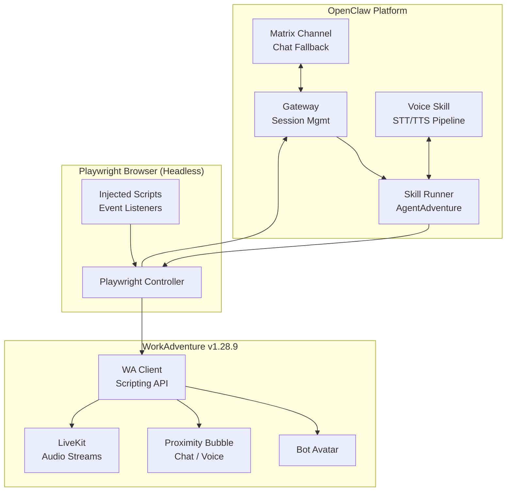

<p align="center">
  <strong>🎮 AgentAdventure</strong><br/>OpenClaw skill that drops AI agents into self-hosted <a href="https://workadventu.re">WorkAdventure</a> as real avatars — with movement, proximity chat, and experimental voice.
</p>

<p align="center">
  
  
  
  
  
  
</p>

-----

## Table of Contents

- [Overview](#overview)
- [Features](#features)
- [Architecture](#architecture)
- [File Structure](#file-structure)
- [Quick Start](#quick-start)
- [Configuration](#configuration)
- [Usage](#usage)
- [Voice Integration](#voice-integration)
- [Security](#security)
- [Risks & Mitigations](#risks--mitigations)
- [Troubleshooting](#troubleshooting)
- [References](#references)

-----

## Overview

AgentAdventure is an [OpenClaw](https://openclaw.ai) skill that enables AI agents to appear as visible avatars in a self-hosted [WorkAdventure](https://workadventu.re) virtual office. Each agent runs inside a headless Chromium browser controlled by Playwright, interacting with the WA Scripting API for movement, proximity chat, and experimental voice conversations — all without modifying the WorkAdventure backend.

Agents enter WorkAdventure the same way a human would: through the anonymous login flow (display name → Woka avatar picker → map entry). Once inside, injected scripts bridge WA events back to the OpenClaw gateway, where agent logic generates responses and sends commands. Matrix provides fallback messaging for non-proximity interactions and multi-agent coordination.

The entire skill is a single folder (`~/.openclaw/skills/agentadventure/`) deployable via `clawdhub install agentadventure` or manual placement.

## Features

- **Avatar Presence** — Agents appear as real WA users with visible avatars, movement via `WA.player.moveTo()`, and full participation in proximity bubbles.
- **Proximity Chat** — Bidirectional text chat using `WA.chat.sendChatMessage` / `onChatMessage` with `'bubble'` scope and typing indicators.
- **Player Tracking** — Detects nearby players via `WA.players.onPlayerEnters` / `onPlayerLeaves` (with `configureTracking()`), plus bubble lifecycle via `proximityMeeting.onJoin()`.
- **Voice (Experimental)** — STT/TTS pipeline through WA’s `listenToAudioStream` / `startAudioStream` APIs, bridged to OpenClaw voice skills (ElevenLabs, Deepgram). Falls back to text on failure.
- **Matrix Fallback** — Leverages WA’s native Matrix bridge for global messaging, room sync, and non-proximity interactions via OpenClaw’s existing Matrix channel.
- **Error Recovery** — Retry wrapper (3 attempts) on all operations, auto-restart on browser crash, voice→text fallback chain. All errors are non-fatal and logged.
- **No Backend Mods** — Pure client-side automation via Playwright. Zero changes to WorkAdventure server code.

## Architecture

The skill spawns a Playwright browser session per agent, injects WA Scripting API event listeners, and bridges callbacks to the OpenClaw gateway via `page.exposeFunction`. Outbound commands (move, chat, voice) flow from agent logic through `page.evaluate()` calls.



### Command Flow (Outbound)

Agent logic sends a command (move/chat/voice) → OpenClaw gateway routes it to the AgentAdventure skill → Playwright calls `page.evaluate()` → WA Scripting API executes the action (avatar moves, message appears in bubble).

### Event Flow (Inbound)

A human enters a proximity bubble → WA fires `proximityMeeting.onJoin` → injected listener calls `window.onWAEvent('join', users)` → Playwright bridges the callback to the gateway → agent logic processes and responds. The same pattern applies to chat messages (`onChatMessage`) and audio buffers (`listenToAudioStream`).

### Voice Pipeline

Incoming audio flows through WA’s `listenToAudioStream` (Float32Array buffers) → an injected listener collects buffers → STT (Deepgram/ElevenLabs) transcribes → agent LLM generates a response → TTS synthesizes audio → `startAudioStream` / `appendAudioData` sends it back to the bubble.

> ⚠️ WA blog documents PCM16 at 24kHz converted to Float32 for the Web Audio API. Verify the actual `sampleRate` parameter from WA source before hardcoding.

### Error & Recovery

Every operation follows a retry → fallback → restart chain. Transient failures retry up to 3 times. Voice failures drop to text chat. Browser crashes trigger an automatic session restart. Non-recoverable errors notify the gateway without crashing the skill.

### Matrix Integration

WA’s native Matrix bridge syncs proximity bubbles to Matrix rooms. The OpenClaw Matrix channel handles `m.room.message` events for fallback/global messaging and multi-agent coordination outside proximity range.

## File Structure

```
~/.openclaw/skills/agentadventure/
├── SKILL.md          # Skill definition — YAML frontmatter + usage instructions
├── runner.ts         # Playwright session: launch, anonymous login, lifecycle, retry
├── bridge.ts         # Event bridge: WA Scripting API ↔ OpenClaw agent logic
├── voice.ts          # Voice pipeline: listenToAudioStream → STT → LLM → TTS → startAudioStream
├── utils.ts          # Shared helpers: retryOp, parseCoords, getMessage, rate limiting
└── __tests__/
    ├── runner.test.ts
    ├── bridge.test.ts
    └── voice.test.ts
```

Configuration lives in `~/.openclaw/openclaw.json` under `skills.entries.agentadventure`. OpenClaw skills are SKILL.md folders — there is no `plugin.json`.

## Quick Start

### Prerequisites

- Docker and Docker Compose
- Node.js v20+
- Git
- API keys for voice services (e.g., ElevenLabs) — optional, only needed for voice
- Server: 4GB RAM, 2 cores minimum

### 1. Deploy WorkAdventure

```bash
git clone https://github.com/workadventure/workadventure.git && cd workadventure
cp .env.template .env   # Edit domain/ports/Matrix settings

# Start with anonymous access (no OIDC):
docker-compose -f docker-compose.yaml -f docker-compose-no-oidc.yaml up -d
```

Add to `/etc/hosts`:

```
127.0.0.1 oidc.workadventure.localhost redis.workadventure.localhost play.workadventure.localhost traefik.workadventure.localhost matrix.workadventure.localhost extra.workadventure.localhost icon.workadventure.localhost map-storage.workadventure.localhost uploader.workadventure.localhost maps.workadventure.localhost api.workadventure.localhost front.workadventure.localhost
```

Access at `http://play.workadventure.localhost/`. With anonymous access, bots enter by providing a display name — no user accounts needed.

For production, add `docker-compose.livekit.yaml` for voice and secure HTTPS via Traefik.

### 2. Install OpenClaw

```bash
npm install -g openclaw@latest
# First run creates workspace automatically — no explicit init needed
openclaw gateway start   # starts gateway; creates ~/.openclaw/ structure on first run
```

### 3. Install the Skill

```bash
# Option A: From ClawHub (once published)
clawdhub install agentadventure

# Option B: Manual (during development)
mkdir -p ~/.openclaw/skills/agentadventure
# Copy SKILL.md, runner.ts, bridge.ts into the folder
cd ~/.openclaw/skills/agentadventure && npx playwright install chromium

# Verify:
openclaw skills list --eligible
```

### 4. Configure & Run

Add the skill entry to `~/.openclaw/openclaw.json` (see [Configuration](#configuration)), then restart the gateway:

```bash
openclaw gateway start
```

Verify by joining the WA map — the agent avatar should appear and respond to proximity chat.

## Configuration

All configuration lives in `~/.openclaw/openclaw.json`:

```json5
{
  "skills": {
    "entries": {
      "agentadventure": {
        "enabled": true,
        "env": {
          "WA_URL": "http://play.workadventure.localhost/",
          "WA_BOT_NAME": "AgentBot"
        }
      }
    }
  }
}
```

For voice support, also configure the voice-call skill:

```json5
{
  "skills": {
    "entries": {
      "agentadventure": { "enabled": true, "env": { "WA_URL": "...", "WA_BOT_NAME": "AgentBot" } },
      "voice-call": { "enabled": true, "env": { "ELEVENLABS_API_KEY": "your-key-here" } }
    }
  }
}
```

> WA with `docker-compose-no-oidc.yaml` uses anonymous login (name + Woka picker). No username/password credentials are needed — the bot enters a display name programmatically.

## Usage

Once deployed, the agent uses the skill when instructed to join WorkAdventure. The skill handles the full lifecycle:

1. **Session launch** — Playwright opens a headless Chromium, navigates to the WA URL, completes anonymous login (enters name, confirms Woka avatar, waits for game canvas).
1. **Event injection** — Bridge injects listeners for proximity (`onJoin`, `onPlayerEnters/Leaves`), chat (`onChatMessage` with bubble scope), and optionally voice (`listenToAudioStream`).
1. **Bidirectional interaction** — Inbound WA events are bridged to the agent via `page.exposeFunction`; outbound commands execute via `page.evaluate` (move, chat with typing indicators, voice).
1. **Recovery** — Failures retry up to 3 times; voice falls back to text; browser crashes trigger auto-restart.

Logs are available via `openclaw logs` and `docker logs` for WA containers.

For multiple agents, scale with Kubernetes/Helm and limit browsers via environment variables.

## Voice Integration

Voice support is **experimental** and depends on WA’s `startAudioStream` / `listenToAudioStream` APIs.

The pipeline works as follows: incoming audio from the WA bubble arrives as Float32Array buffers via `listenToAudioStream`. These buffers are collected and sent to a STT provider (Deepgram or ElevenLabs). The transcription feeds into the agent LLM, which generates a response. That response is synthesized via TTS and streamed back through `startAudioStream` / `appendAudioData`.

On any voice failure (STT timeout, TTS error, stream routing issue), the skill automatically drops to text chat. Headless audio routing uses Playwright’s `--use-fake-device-for-media-stream` flag; LiveKit handles the WebRTC transport.

## Security

### Authentication & Authorization

- Encrypt API keys at rest via OpenClaw `skills.entries.*.env` / `skills.entries.*.apiKey`; rotate every 90 days.
- Scope session tokens per agent with JWT claims; expire after 1 hour of inactivity.
- Enforce role-based access — deny on `agentId` mismatch.

### API & Network

- Rate-limit exposed functions (10 calls/sec per agent); validate with Joi schemas.
- Secure WebSocket bridges (`wss://`, bearer tokens).
- Isolate Docker networks; firewall whitelists trusted domains only (workadventure.io, elevenlabs.io).
- Prometheus monitoring; Grafana dashboards; alert on anomalies >50%.

### Dependencies & Compliance

- Weekly `npm audit` / Snyk scans; remediate high-severity vulns within 7 days.
- Quarterly API key rotation (ElevenLabs, Deepgram).
- ESLint-security + OWASP checks in CI/CD; annual pen testing with Burp Suite.

## Risks & Mitigations

### Core

|Risk                                            |Mitigation                              |Verification                                          |
|------------------------------------------------|----------------------------------------|------------------------------------------------------|
|Playwright instability / browser crashes        |Docker sandbox; auto-restart sessions   |Log “Session restarted after crash”                   |
|WA Scripting API is client-only (no server bots)|Full browser automation; Matrix fallback|Dry-run script injection; compare manual vs. automated|
|Perf overhead (browser per agent)               |Limit agents; lightweight Chromium      |Benchmark CPU/mem; prove <20% overhead                |
|Credentials exposure                            |Gateway permissions; encrypt keys       |Audit logs; no leaks in tests                         |

### Proximity & Events

|Risk                                    |Mitigation                                       |Verification                                      |
|----------------------------------------|-------------------------------------------------|--------------------------------------------------|
|Event drops in automated browser        |RxJS subs with retries; websocket bridge         |Sim bubble join/leave; 100% capture in logs       |
|Bubble scope limits (no history on join)|Agent state tracks context; fetch players on join|Test msg before/after join; agent ignores pre-join|
|Flaky tests/timeouts                    |Auto-wait assertions; retries on transients      |Induce delay → retry logs success                 |
|WA script load errors (CORS)            |Console listener + restart                       |Sim bad script → log/catch/restart                |

### Voice

|Risk                            |Mitigation                                       |Verification                                         |
|--------------------------------|-------------------------------------------------|-----------------------------------------------------|
|Headless audio routing fails    |Fake streams for tests; LiveKit node SDK bridge  |Log stream capture/playback; compare manual vs. agent|
|High latency in STT/TTS         |Low-latency providers (Deepgram); cache responses|Measure e2e <500ms vs. WA native (~200ms)            |
|Audio leaks                     |Encrypt streams; scope voice perms               |Audit no external sends without consent              |
|Experimental voice APIs unstable|Fallback to text; monitor WA docs/GitHub         |Test stream start/listen; logs show buffers          |

### Verification Strategy

- **Unit:** Vitest on runner, bridge, and voice modules.
- **E2E:** Full flow against WA v1.28.9 Docker — human-agent proximity chat roundtrip.
- **Voice E2E:** Fake audio stream → STT → LLM → TTS → verify playback; test fallback on failure.
- **Error E2E:** Kill browser mid-session → verify auto-restart and recovery logs; >95% uptime.
- **Performance:** <20% CPU/mem overhead per agent; voice latency <500ms end-to-end.

## Troubleshooting

|Issue                  |Fix                                                                                                        |
|-----------------------|-----------------------------------------------------------------------------------------------------------|
|Browser crash          |Check Playwright logs; restart the gateway (`openclaw gateway start`)                                      |
|Login failure          |WA anonymous login: verify name input selector; test in non-headless mode; increase timeouts in `runner.ts`|
|Missed proximity events|Inspect injected script; ensure `configureTracking()` is called; sim with manual joins; fallback to Matrix |
|Voice latency          |Test STT/TTS providers; cache responses; fallback to text on >500ms                                        |
|Matrix sync issues     |Confirm WA Matrix bridge config; check OpenClaw channel perms; resync rooms                                |
|High CPU               |Limit to <5 agents per browser; use `headless: false` for debug; monitor with `top`/`htop`                 |
|Skill not eligible     |Run `openclaw skills list --eligible`; check `requires.bins` are on PATH; restart gateway                  |
|General                |Enable verbose logging; check WA/OpenClaw docs and GitHub issues                                           |

## References

- [Integration Plan (PLAN.md)](./PLAN.md)
- [WorkAdventure Scripting API — Chat](https://docs.workadventu.re/developer/map-scripting/references/api-chat/)
- [WorkAdventure Scripting API — Player](https://docs.workadventu.re/developer/map-scripting/references/api-player/)
- [WorkAdventure Scripting API — Players (tracking)](https://docs.workadventu.re/developer/map-scripting/references/api-players/)
- [WorkAdventure ChatGPT Bot Tutorial](https://docs.workadventu.re/blog/gpt-bot/)
- [WorkAdventure Tock Bot Tutorial](https://docs.workadventu.re/blog/tock-bot/)
- [WorkAdventure Realtime API (voice)](https://docs.workadventu.re/blog/realtime-api/)
- [OpenClaw Skills Docs](https://docs.openclaw.ai/tools/skills)
- [Playwright API Reference](https://playwright.dev/docs/api/class-page)
